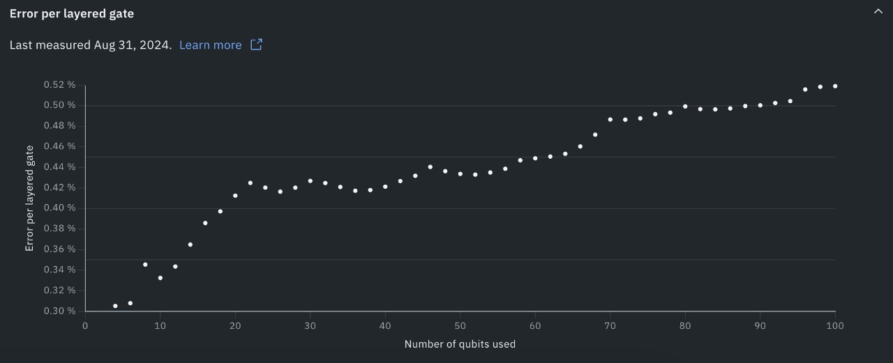

# 🏆 QPU Circuit Packing – Winning Submission at Q-SITE Hackathon 2024

## 🚀 Overview

This repository contains the **first-place winning submission** for the **QPU Circuit Packing Challenge** at the **Q-SITE Hackathon 2024**. Our project introduces a hardware-aware approach to packing multiple copies of quantum circuits onto a single QPU execution, **maximizing efficiency** while maintaining **high fidelity**.

---

## 🧠 Problem Statement

Most quantum algorithms underutilize today's large QPUs. For example, running a 20-qubit circuit on IBM’s 127-qubit Eagle chip wastes over 100 idle qubits.

**Goal**:  
Develop a strategy to **replicate and pack** a user's small circuit multiple times on a QPU, **reduce the required number of shots**, and **control fidelity degradation**.

---

## 🎯 Key Objectives

- 🧩 Replicate the input quantum circuit `n` times.
- ⚙️ Transpile each copy to disjoint, high-fidelity subregions of the QPU.
- 🔬 Execute all copies in **one job**, reducing total shots.
- 📊 Recover and **separate measurement results** with minimal fidelity loss.

---

## 🔍 Technical Highlights

### ✅ Qubit Placement
- Uses IBM's **coupling map** and `Layout2qDistance` to assign the best zones to each circuit.
- Avoids "noisy" or poorly connected qubits, guided by modularity-based community detection.

### 🔁 Packing Strategy
- **Greedy + Graph Partitioning** hybrid algorithm to identify optimal qubit clusters.
- Adaptive to backend architecture (e.g., IBM Fez, Eagle).

### 📉 Crosstalk Mitigation
- Spatial separation enforced during packing to reduce coherent noise from RF interference.

---

## 📈 Result

Our method demonstrates:
- 📦 **Efficient QPU utilization** (up to 9x packing on 127 qubits).
- 🎯 Fidelity loss < 5% across multiple circuit copies.
- ⏱️ 5x–9x **reduction in total runtime**.

---

## 📂 Contents

- `notebook.ipynb`: Main implementation and experiment notebook.
- `packing_algorithm.py`: Core logic for zone partitioning and layout.
- `results/`: Benchmark results, fidelity plots, and comparisons.
- `ibm_fez.jpg`: Reference chart for hardware-aware error trends.

---

## 🧪 Tools & Technologies

- 🧱 [Qiskit](https://qiskit.org/) for circuit definition and transpilation.
- 🔍 `networkx` for backend graph analysis.
- 📦 IBM Q backend APIs (via `qiskit-ibm-runtime`) for live deployment.
- 📊 Matplotlib for visualization and fidelity analysis.

---

## 📜 Citation

> QPU Circuit Packing: A Fidelity-Aware Multi-Copy Execution Strategy.  
> 🏆 Winner – Q-SITE Hackathon 2024  
> Authors: Hemish Ahuja, Mukul, Maral, Negar

---

## 📅 Last Evaluated:  
August 31, 2024 — on IBM Fez

---

## 🤝 Acknowledgments

Huge thanks to **Haiqu**, **IBM Quantum**, and the **Q-SITE Hackathon organizers** for hosting this cutting-edge quantum challenge.

---

## 📬 Contact

Feel free to reach out or connect on [LinkedIn](https://www.linkedin.com/in/hemishahuja/) if you want to collaborate or learn more!

