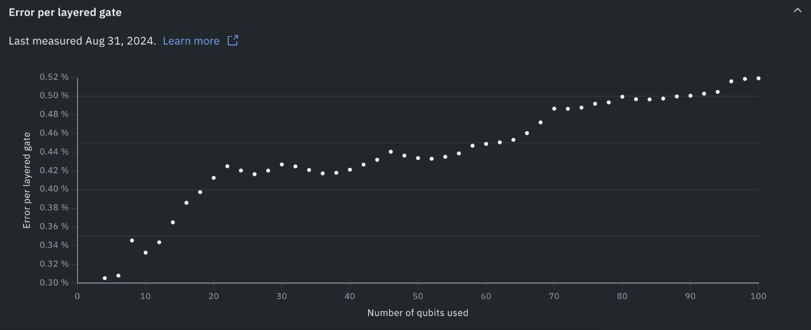

# QPU Spatial Multiplexing via Hardware-Aware Circuit Packing

<p align="center">
  
  
  
  
  
</p>

> **Suggested repo name:** `qpu-spatial-multiplexing` — more technically precise and searchable.

**First-place winning submission** at the [Q-SITE Hackathon 2024](https://qsite.ca/) (QPU Circuit Packing Challenge), hosted by **Haiqu** and **IBM Quantum**.

This project introduces a **hardware-aware spatial multiplexing** strategy that packs multiple independent copies of a quantum circuit onto disjoint qubit subgraphs of a large QPU, executing them in a single job. The technique achieves up to **9× QPU utilization** and **5–9× runtime reduction** with **< 5% fidelity loss**.

---

## Table of Contents

- [Problem Statement](#problem-statement)
- [Approach & Algorithm](#approach--algorithm)
- [Results](#results)
- [Repository Structure](#repository-structure)
- [Setup & Usage](#setup--usage)
- [Technologies](#technologies)
- [Citation](#citation)
- [Acknowledgments](#acknowledgments)

---

## Problem Statement

Modern QPUs (e.g., IBM Eagle at 127 qubits) are chronically underutilized when running small circuits of 10–20 qubits. Idle qubits waste coherence time and require proportionally more shots to achieve statistical significance.

**Challenge:** Design a strategy to:
1. Replicate a small user circuit `n` times.
2. Map each copy to a **disjoint, noise-optimal qubit subregion** of the QPU.
3. Execute all copies in a **single job** to reduce total shot count.
4. Post-process the combined measurement bitstring to recover per-copy results.

---

## Approach & Algorithm

The pipeline has four stages:

```
Input Circuit
      │
      ▼
┌─────────────────────────────────────┐
│  Stage 1: QPU Graph Partitioning    │
│  • Build coupling-map graph         │
│    (NetworkX)                       │
│  • Greedy modularity community      │
│    detection → k disjoint zones     │
└──────────────┬──────────────────────┘
               │
               ▼
┌─────────────────────────────────────┐
│  Stage 2: Layout-Aware Transpilation│
│  • Per-copy Layout2qDistance        │
│    scoring on each zone             │
│  • optimization_level=3 transpile   │
│    with fixed initial_layout        │
└──────────────┬──────────────────────┘
               │
               ▼
┌─────────────────────────────────────┐
│  Stage 3: Circuit Composition       │
│  • Merge n transpiled copies into   │
│    one circuit with n classical     │
│    registers (spatial isolation)    │
│  • Crosstalk mitigation via         │
│    spatial separation of zones      │
└──────────────┬──────────────────────┘
               │
               ▼
┌─────────────────────────────────────┐
│  Stage 4: Execution & Demultiplexing│
│  • Single job → 1024 shots          │
│  • Bitstring slicing by register    │
│    boundaries → per-copy counts     │
└─────────────────────────────────────┘
```

### Key Technical Details

| Component | Technique |
|-----------|-----------|
| **Zone detection** | Greedy modularity community detection (`networkx.community`) |
| **Qubit scoring** | `Layout2qDistance` pass from Qiskit transpiler |
| **Transpilation** | `qiskit.compiler.transpile` with `optimization_level=3` and fixed `initial_layout` |
| **Crosstalk mitigation** | Spatial separation — adjacent zones avoided; community boundaries act as buffer |
| **Result recovery** | Per-copy classical registers; bitstring sliced by register width post-execution |
| **Target hardware** | IBM Sherbrooke (27 q), IBM Eagle (127 q), IBM Fez (156 q) |

---

## Results

Evaluated on **IBM Fez** (156-qubit Heron QPU) on August 31, 2024.

| Metric | Value |
|--------|-------|
| Max copies packed (127-qubit Eagle) | **9×** |
| Runtime reduction | **5×–9×** |
| Fidelity degradation | **< 5%** |
| Shots per job | 1024 |


*Figure: Gate error trends on IBM Fez used to inform noise-aware zone selection.*

---

## Repository Structure

```
qpu-spatial-multiplexing/
├── qpu_circuit_packing.ipynb   # Full implementation: partitioning, transpilation,
│                               # composition, execution, and result demultiplexing
├── ibm_fez.jpg                 # IBM Fez hardware error-rate reference chart
└── README.md
```

---

## Setup & Usage

### Prerequisites

- Python 3.9+
- An [IBM Quantum](https://quantum.ibm.com/) account and API token (for real hardware)

### Installation

```bash
pip install qiskit qiskit-aer qiskit-ibm-runtime networkx matplotlib
```

### Running the Notebook

```bash
jupyter notebook qpu_circuit_packing.ipynb
```

**Steps inside the notebook:**

1. **Cell 1 – Configure IBM Quantum service**
   ```python
   from qiskit_ibm_runtime import QiskitRuntimeService
   QiskitRuntimeService.save_account(channel="ibm_quantum", token="YOUR_API_TOKEN")
   ```

2. **Cell 2 – Select backend** (real hardware or `AerSimulator` for local testing)

3. **Cell 3 – Define circuit & partition QPU**
   Specify your circuit and number of copies; community detection identifies qubit zones.

4. **Cells 4–5 – Transpile and compose**
   Each copy is individually transpiled to its zone, then merged into a single composite circuit.

5. **Cell 6 – Execute**
   Submit the packed circuit as a single job (1024 shots).

6. **Cell 7 – Demultiplex results**
   Recover per-copy measurement distributions from the combined result bitstrings.

> **Tip:** Set `use_simulator = True` in Cell 2 to run locally without an IBM Quantum account.

---

## Technologies

| Library | Role |
|---------|------|
| [Qiskit](https://qiskit.org/) | Circuit definition, transpilation (`Layout2qDistance`, `optimization_level=3`) |
| [Qiskit IBM Runtime](https://github.com/Qiskit/qiskit-ibm-runtime) | Authenticated access to IBM QPU backends |
| [NetworkX](https://networkx.org/) | Coupling-map graph construction and community detection |
| [Matplotlib](https://matplotlib.org/) | Fidelity analysis and result visualization |

---

## Citation

If you use or build upon this work, please cite:

```
QPU Spatial Multiplexing via Hardware-Aware Circuit Packing.
1st Place — QPU Circuit Packing Challenge, Q-SITE Hackathon 2024.
Authors: Hemish Ahuja, Mukul, Maral, Negar.
```

---

## Acknowledgments

Thanks to **[Haiqu](https://haiqu.ai/)**, **[IBM Quantum](https://quantum.ibm.com/)**, and the **Q-SITE Hackathon 2024** organizers for the problem statement and access to real quantum hardware.

---

## Contact

**Hemish Ahuja** — [LinkedIn](https://www.linkedin.com/in/hemishahuja/)

Open to collaboration on quantum computing, circuit optimization, and hardware-aware algorithm design.
