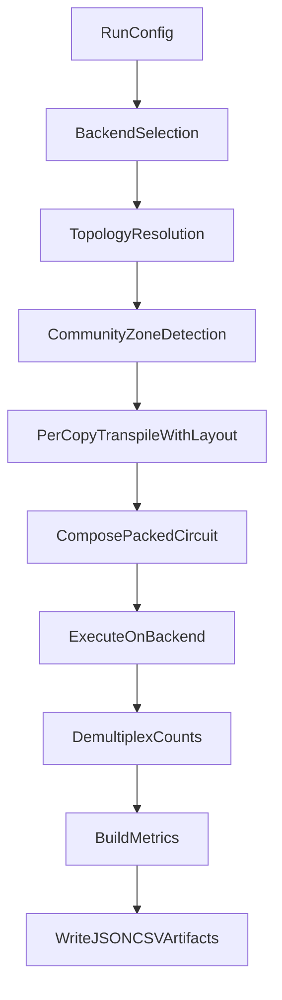

# Architecture

## Package layout

- `config.py`: typed run configuration and validation.
- `circuits.py`: canonical sample circuit construction.
- `partitioning.py`: coupling-map graph and community partitioning.
- `placement.py`: zone slicing and layout pass-manager setup.
- `packing.py`: per-copy transpilation and combined circuit composition.
- `execution.py`: backend selection and job execution.
- `demux.py`: per-copy output slicing from packed counts.
- `metrics.py`: utilization and execution summary metrics.
- `pipeline.py`: end-to-end orchestration.
- `benchmark.py`: packed-vs-baseline comparison logic.
- `cli.py`: command line interface.

## End-to-end flow

## Reliability decisions

- Simulator-first default avoids account/token dependency and enables deterministic CI.
- Hardware mode requires environment-based token loading (`IBM_QUANTUM_API_TOKEN`).
- Coupling map fallback supports unconstrained simulators by synthesizing a chain topology.
- Validation guards reject invalid qubit counts, copy counts, and shot values early.
